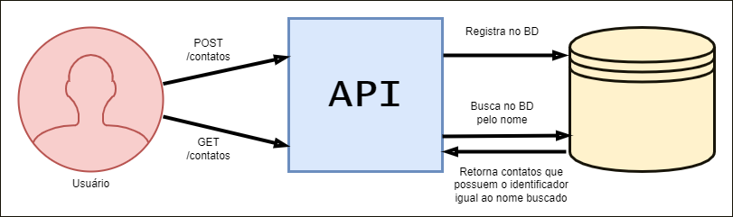

# Lista de Contatos com Java e Spring

## Descrição
O projeto lista-de-contatos é uma API feita com Java e Spring com o objetivo de registrar em um banco de dados diversos contatos, cada qual com seus respectivos dados:

- Idenficação
- Número
- Número 2
- E-mail 
- Data de aniversário

Sendo a identificação e o número dados obrigatórios.

## Tecnologias

- Maven
- Spring Boot - Configurações Iniciais
- Spring Framework - Inversão de Controle com Injeção de Dependências
  - > A forma utilizada foi a injeção de dependência por anotação com _@Autowired_
- Spring Data - Acesso ao banco de dados com JpaRepository
  - > ``` public interface ContatoRepository extends JpaRepository<Contato, Integer>```
- Spring Validation - Validação de e-mail
  - > ```@Email private String email ```

## Banco de Dados
Foi utilizado o PostgreSQL, juntamente com o Postman para fazer os testes de requisições.

## Diagrama

|  |
|:--:| 
|*Diagrama de como funciona a API.* |

*O usuário faz uma requisição do tipo POST, fazendo com que a API registre um contato no banco de dados;*

*O usuário faz uma requisição do tipo GET, fazendo com que a API busque no banco de dados e retorne todos os usuários que possuam o identificador igual ao nome buscado.*